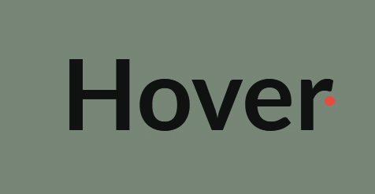
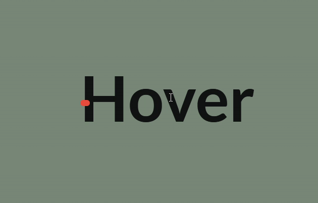

# [Line Through on Hover](https://developer.mozilla.org/en-US/docs/Web/CSS/:hover)

>The :hover CSS pseudo-class matches when the user interacts with an element with a pointing device, but does not necessarily activate it. It is generally triggered when the user hovers over an element with the cursor (mouse pointer).

The key of the line-through (strike-through) is using the `::before` pseudo element as the line. Change make the animation based on the `right` and `width` of `::before`.

```css
.text-animation {

  span:nth-child(odd) {
    position: relative;
    z-index: 2;
  }

  &::before {
    padding: 0;
    content: '';
    position: absolute;
    bottom: 35%;
    left: auto;
    right: 0;
    width: 0;
    height: 8%;
    border-radius: 80px;
    background-color: #e74c3c;
    transform: translateY(-50%);

    transition: 0.8s cubic-bezier(0.4, 0, 0, 1);
    z-index: 1;
  }

  &:hover::before {
    width: 100%;
    right: auto;
    left: 0;
  }
}
```

Change the `:nth-child` to change between the odd and the even that the line go through.

```css
  span:nth-child(odd) {
    position: relative;
    z-index: 2;
  }
```

- Through The Odd Characters


```css
  span:nth-child(even) {
    position: relative;
    z-index: 2;
  }
```

- Through The Even Characters

