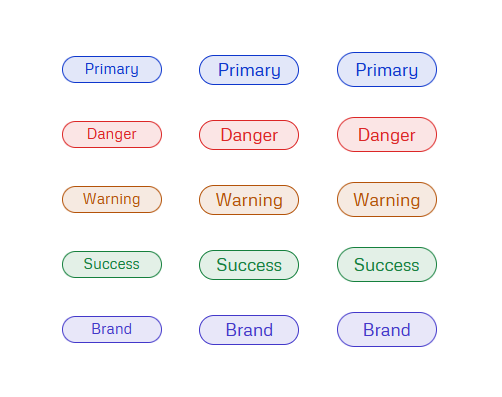

# System Badge by currentColor

> The currentcolor keyword represents the value of an element's color property. This lets you use the color value on properties that do not receive it by default.

The key of system badge is the combination of [`color-mix`](https://developer.mozilla.org/en-US/docs/Web/CSS/color_value/color-mix) function with [`currentColor`](https://developer.mozilla.org/en-US/docs/Web/CSS/color_value#currentcolor_keyword).

```css
:root {
 --color-primary-bg: color-mix(in srgb, var(--color-primary-border) 12%, transparent);
 --color-primary-border: currentColor;
 --color-primary-text: #0e37cd;
 }

.badge--color-primary {
 background: var(--color-primary-bg);
 border-color: var(--color-primary-border);
 color: var(--color-primary-text);
}

```

