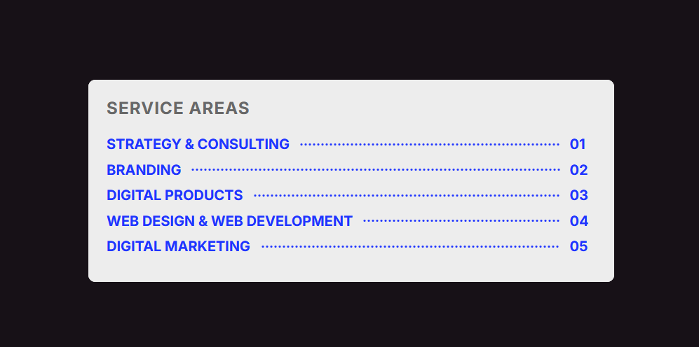

# Trail Dotted with Vanilla CSS

A series of dots that visually connect two pieces of text, typically between a title and a page number.

By using `flexbox` and `border-bottom`.

```css
.service-item__dot {
  flex: 1;
  height: 1px;
  border-bottom: 3px dotted hsl(234, 100%, 56%);
  margin: 0 10px;
}
```



