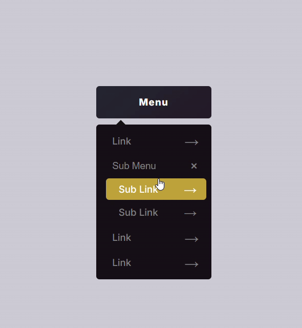

# [Dropdown Sub-Menu](https://en.wikipedia.org/wiki/Drop-down_list)

> A dropdown menu is a graphical user interface element that displays a list of options when a user interacts with a specific control, like a button or icon

<video width="480" height="300" controls>
  <source src="screenshot.mp4" type="video/mp4">
</video>

