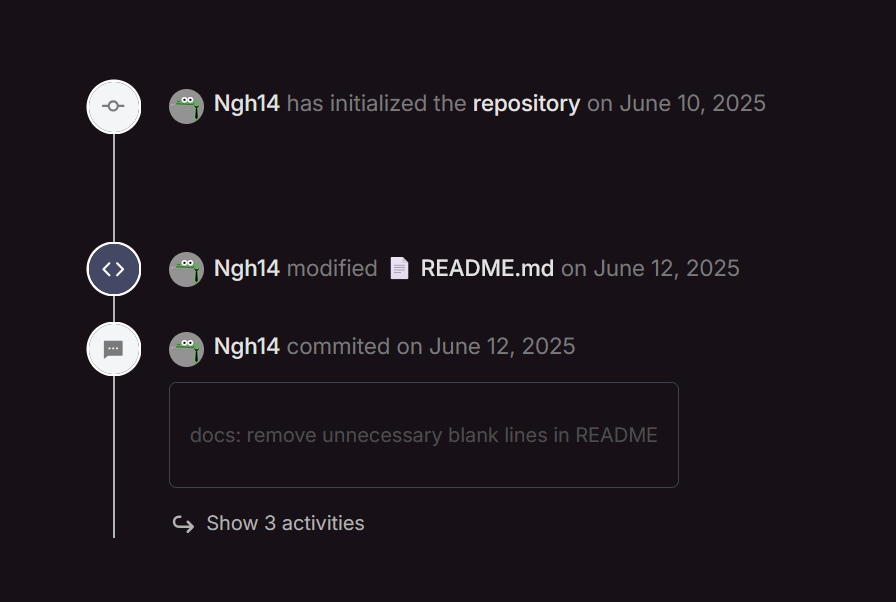

# Timeline

> the visual representation of events or activities arranged in order

Day #93 timeline is inspired by the Timeline CSS CodePen Challenge.

The key of this component is the `::before` pseudo element as the line by the `position: absolute` which have the `width` is haft of the svg icon in the timeline.

```css
.timeline {
  display: flex;
  flex-direction: column;
  position: relative;

  font-size: 1.125rem;

  img {
    display: block;
    max-width: 100%;
  }

  &::before {
    content: '';
    position: absolute;
    transform: translateX(-50%);
    left: 8px;
    top: 0;
    bottom: 0;
    width: 2px;
    background-color: var(--grey-300);
    z-index: -1;
  }
}
```



- svg ref: `https://www.svgrepo.com/`
