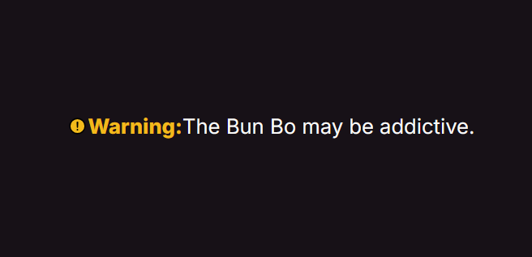

# [SVG Background Image](https://developer.mozilla.org/en-US/docs/Web/CSS/CSS_backgrounds_and_borders/Scaling_of_SVG_backgrounds)

>Given the flexibility of SVG images, there's a lot to keep in mind when using them as background images with the background-image property, and even more to keep in mind when scaling them using the background-size property. This article describes how scaling of SVG images is handled when using these properties.

The key of this component is the `::before` pseudo element which hold the SVG `background-image` by `url("data:image/svg+xml;utf8, <svg> <svg>)`.

```css
p {
 &::before {
    content: '';
    background-image: url("data:image/svg+xml;utf8,<svg xmlns='http://www.w3.org/2000/svg' viewBox='0 0 512 512'><path d='M448 256c0-106-86-192-192-192S64 150 64 256s86 192 192 192 192-86 192-192z' fill='%23f3bb1b' stroke='currentColor' stroke-miterlimit='10' stroke-width='32' /><path d='M250.26 166.05L256 288l5.73-121.95a5.74 5.74 0 00-5.79-6h0a5.74 5.74 0 00-5.68 6z' fill='none' stroke='currentColor' stroke-linecap='round' stroke-linejoin='round' stroke-width='32' /><path d='M256 367.91a20 20 0 1120-20 20 20 0 01-20 20z' /></svg>");
    width: 1em;
    height: 1em;
  }
}
```

__NOTE__: make sure using the encode of `#` as `%23` when using hex code in `background-image/l url()`



- svg ref: `https://www.svgrepo.com/`
