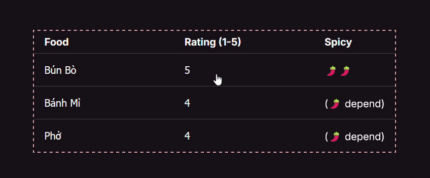

# [Table focus-within](https://developer.mozilla.org/en-US/docs/Web/CSS/:focus-within)

> The :focus-within CSS pseudo-class matches an element if the element or any of its descendants are focused. In other words, it represents an element that is itself matched by the :focus pseudo-class or has a descendant that is matched by :focus. (This includes descendants in shadow trees.)

The key of this component is the `:focus-within` pseudo class to catch the event when the table is focus but not with table row.

```css
table {
  table {
  border-collapse: collapse;
  border-radius: 10px;

  &:focus-within tbody tr:not(:focus-within) {
    filter: blur(1px) saturate(0.1);
    pointer-events: none;
    opacity: 0.8;
  }

}
```



Also the combination `:not()` CSS pseudo-class and `:last-of-type` to implement the border inside the table

```css
tr:not(:last-of-type) {
  border: 1px solid hsl(0, 0%, 27%);
  border-left: 0;
  border-right: 0;
}
```

Using `:last-of-type` to avoid the override outside border of the table.

**NOTE:** make sure to set the `width: 100%` if `type=number` of `input` to fill the witdth of table cell. Or just using `type=text`.
