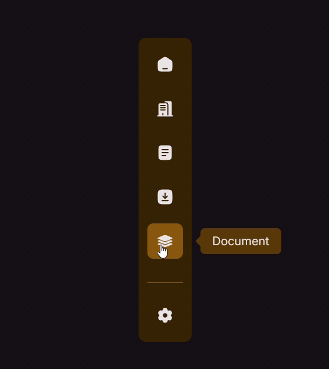

# [Tooltip in Navigation Bar Menu](https://developer.mozilla.org/en-US/docs/Web/Accessibility/ARIA/Reference/Roles/tooltip_role)

>A tooltip is a contextual text bubble that displays a description for an element that appears on pointer hover or keyboard focus.

<video width="480" height="300" controls>
  <source src="screenshot.mp4" type="video/mp4">
</video>



The key of tooltip is `position: absolute` which set default as `transform: scale(0)` and `opacity: 0`

```css
  .tooltip {
    position: absolute;
    background-color: hsl(35, 87%, 20%);
    white-space: nowrap;
    padding: 0.5rem 1rem;
    border-radius: 6px;
    left: calc(100% + 1.5rem);
    transform-origin: center left;
    transform: scale(0);
    opacity: 0;
    transition: 0.15s ease;

    &:before {
      content: '';
      display: block;
      width: 12px;
      height: 12px;
      position: absolute;
      background-color: hsl(35, 87%, 20%);
      left: -5px;
      top: 50%;
      transform: translatey(-50%) rotate(45deg);
      border-radius: 3px;
    }
  }
```

- [`Day#18: Tooltip (abbr)`](../018.Tooltip%20(abbr)/) is another tooltip implement by `abbr` tag.
